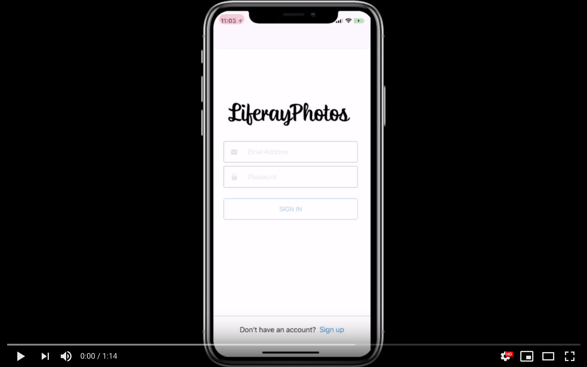

# LiferayPhotos

This is an iOS Instagram-like application to show them the full power of [Liferay Screens](https://github.com/liferay/liferay-screens).

This was develop by only two people in 10 days. The final result is very impressive and originated a series of blog posts describing all the aspects of the project. Here you have a list of the posts:

- [Part 1 - Introduction](https://community.liferay.com/es/blogs/-/blogs/liferayphotos-a-fully-functional-app-in-10-days-using-liferay-screens-part-1-introduction-)
- [Part 2 - Architecture and planning](https://community.liferay.com/es/blogs/-/blogs/liferayphotos-a-fully-functional-app-in-10-days-using-liferay-screens-part-2-architecture-and-planning)
- [Final part - Development experience written by Luis Miguel Barcos, talking about his experience during the project duration (the most interesting one :P)](https://community.liferay.com/es/blogs/-/blogs/liferayphotos-a-fully-functional-app-in-10-days-using-liferay-screens-final-part-development-experience-)

Watch the video:

LiferayScreens mobile development: https://dev.liferay.com/develop/tutorials/-/knowledge_base/7-0/mobile